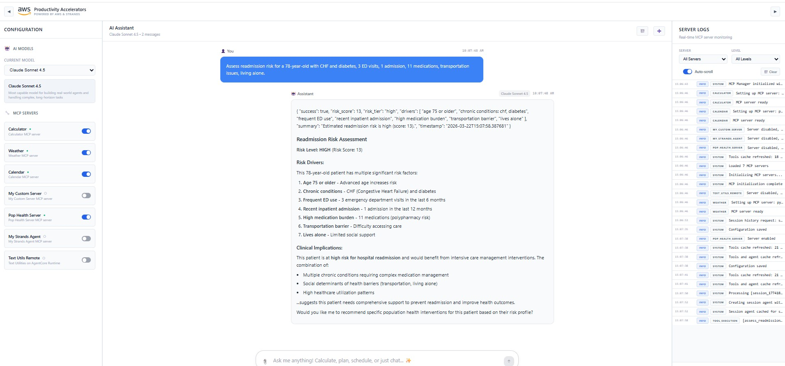
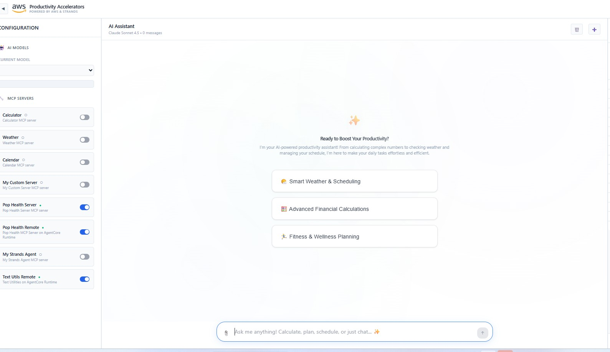
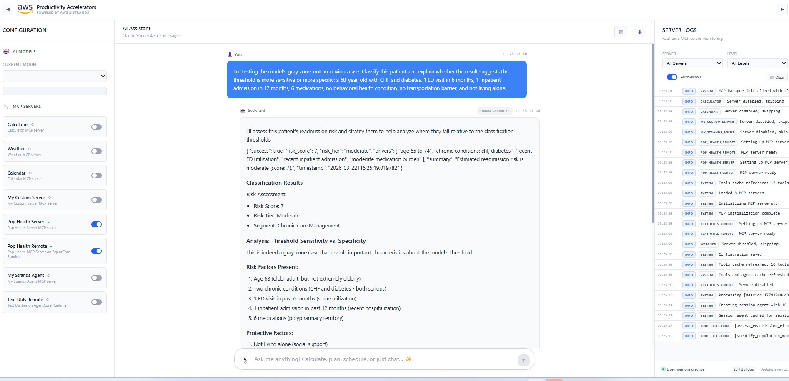
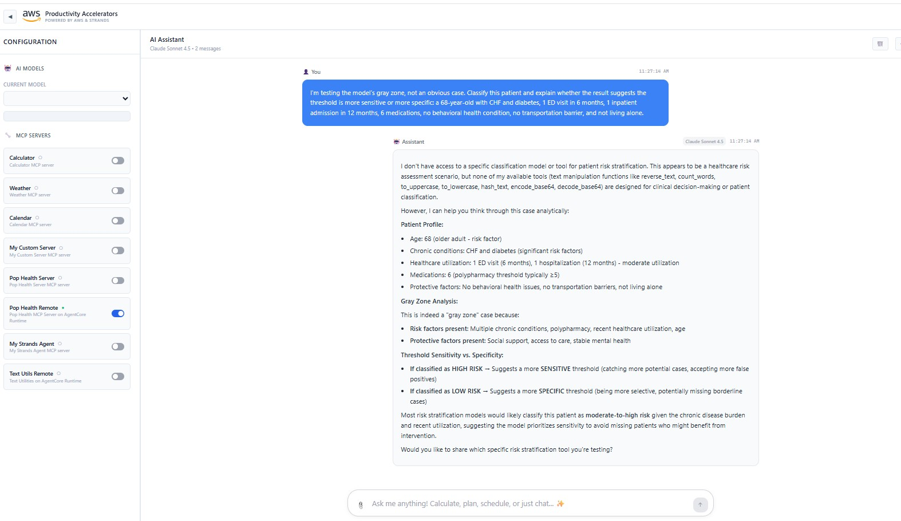

# Population Health Decision Intelligence

A practical implementation of AI-driven decision intelligence for healthcare and population health workflows. This project demonstrates how to turn healthcare data into decision-ready intelligence using tool-based AI systems.

MCP-based decision intelligence tools for population health risk stratification and care management.

Designed to simulate real-world care management and utilization risk workflows in healthcare systems.

---

## 🚀 What this project does

This project demonstrates how to build domain-specific AI tools using the Model Context Protocol (MCP) and AWS Bedrock.

It includes:

* A population health MCP server for readmission risk assessment  
* AgentCore deployment for scalable tool hosting  
* Tool orchestration with LLMs for healthcare decision support  

---

## 📁 Project Structure

```
population-health-decision-intelligence/
├── mcp_servers/
│   ├── readmission_risk_mcp.py
│   └── calculator_mcp.py
│
├── agentcore/
│   ├── readmission_risk_agentcore.py
│   ├── deploy_to_agentcore.py
│   └── update_config.py
│
├── assets/
│   ├── pop-health-mcp-tool-execution.jpg
│   ├── agentcore-mcp-configuration.jpg
│   ├── agentcore-tool-execution.jpg
│   └── gray-zone-testing.jpg
```

---

## 🧠 Example Use Case

Assess readmission risk for a patient using:

* Age  
* Chronic conditions  
* ED visits  
* Inpatient admissions  
* Medication burden  
* Social determinants of health  

**Example prompt:**

```
Assess readmission risk for a 68-year-old with CHF and diabetes,
1 ED visit in 6 months, 1 inpatient admission in 12 months,
6 medications, no behavioral health condition,
no transportation barrier, and not living alone.
```

---

## 🧩 System Walkthrough (From Local Tool → Deployed Intelligence)

This project follows a structured progression from building a domain-specific tool to deploying and testing it in a real orchestration environment.

---

### 1️⃣ Local MCP Tool Execution

The population health MCP server is first validated locally.  
This confirms that domain logic (readmission risk scoring) is correctly implemented and returns structured outputs.



---

### 2️⃣ AgentCore Configuration

The MCP server is then configured for deployment using AWS AgentCore.  
This step transitions the tool from a local environment into a scalable runtime.



---

### 3️⃣ Remote Tool Execution (AgentCore)

Once deployed, the MCP server is invoked remotely through AgentCore.  
Here, the model successfully selects the tool, passes correct parameters, and returns structured results.



---

### 4️⃣ Gray Zone Testing (Sensitivity vs Specificity)

A borderline clinical scenario is used to test how the system behaves under uncertainty.

In this case:

* The model sometimes **does not call the tool**  
* Instead, it falls back to reasoning  

This reveals an important limitation in tool orchestration:

> Even when tools are available, models may not consistently use them.



---

## ⚡ Quick Start

Clone the repository:

```
git clone https://github.com/SaiKurmana/population-health-decision-intelligence.git

cd population-health-decision-intelligence
```

Run the MCP server locally:

```
python mcp_servers/readmission_risk_mcp.py
```

(Optional) Deploy to AgentCore:

```
cd agentcore
python deploy_to_agentcore.py
```

---

## ⚙️ Tech Stack

* Python  
* MCP (Model Context Protocol)  
* AWS Bedrock  
* AgentCore Runtime  

---

## 🧠 What This Demonstrates

* Tool-based AI architecture using MCP  
* Integration of clinical/population health logic into LLM workflows  
* Local vs remote (AgentCore) MCP deployment  
* Decision intelligence over raw model outputs  
* Real-world orchestration behavior (including tool usage gaps)  

---

## 💡 Why This Matters

Most AI demos stop at “the model can answer questions.”

This project focuses on:

* Embedding domain logic into tools  
* Structuring decisions, not just responses  
* Bridging healthcare data → actionable insight  
* Understanding when AI systems **fail to use available tools**  

---

## ⚠️ Disclaimer

This tool is for demonstration purposes only.

It is not clinically validated and should not be used for medical decision-making.

---

Built as part of an AWS GenAI MCP workshop and extended into a healthcare decision intelligence use case.